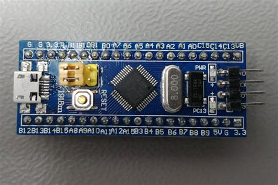

# Blink Project for STM32F103C8 using QP/C Framework

A comprehensive real-time embedded systems project demonstrating the **QP/C (Quantum Platform/C)** event-driven framework on the **STM32F103C8** microcontroller. This project implements a simple LED blinking application using multiple QP/C kernel configurations (QV, QK, QXK).

## 📋 Project Overview

This is a tutorial project designed to learn and understand the **QP/C Real-Time Event Framework** for embedded microcontrollers. The project shows practical implementation of:

- **Active Objects (Actors)** - Concurrent components communicating via events
- **Hierarchical State Machines** - Behavior modeling using UML statecharts
- **Event-driven Architecture** - Asynchronous, non-blocking application design
- **Multiple Kernel Support** - QV (cooperative), QK (preemptive), and QXK (extended) kernels

## 🎯 Target Hardware

### STM32F103C8 (Blue Pill Board)



**Specifications:**
- **Microcontroller**: STM32F103C8T6
- **Core**: ARM Cortex-M3 @ 72 MHz
- **Flash Memory**: 64 KB
- **RAM**: 20 KB  
- **GPIO**: 37 pins
- **Peripherals**: USART, SPI, I²C, ADC, Timers, PWM
- **Development Environment**: Keil µVision 5
- **Board Type**: Popular "Blue Pill" development board (cost-effective)

## 🔧 QP/C Framework

**QP/C** is a lightweight, modern real-time event framework specifically designed for embedded systems and microcontrollers:

### Key Features:
- **Asynchronous Event-Driven Architecture** - Replace polling with event-based design
- **Active Objects** - Modular, concurrent components with their own event queue
- **Hierarchical State Machines** - UML-compliant statechart implementation
- **Small Footprint** - Minimal RAM/ROM overhead, perfect for MCUs
- **Multiple Kernels** - Choose between QV (cooperative), QK (preemptive), or QXK (extended)
- **Software Tracing** - Built-in QS (Quantum Spy) for debugging and analysis
- **Open Source** - Available under GPL v3 with optional commercial licensing
- **Proven Track Record** - 20+ years in production systems, 400+ commercial licensees

### Built-in Kernels:

| Kernel | Type | Use Case |
|--------|------|----------|
| **QV** | Cooperative (non-preemptive) | Simple, deterministic, low overhead |
| **QK** | Preemptive (non-blocking) | Priority-based, responsive systems |
| **QXK** | Extended (blocking) | Thread-like behavior with mutexes/semaphores |

## 📁 Project Structure

```
F103_blink_qpc/
├── User/                      # Application code
│   ├── inc/
│   │   └── bsp.h             # Board Support Package
│   └── src/
│       ├── main.c            # Entry point
│       ├── bsp.c             # BSP implementation
│       └── blink.c           # Blink active object (auto-generated by QM)
├── Drivers/                   # STM32F1 device drivers
│   ├── stm32f10x.h           # Device header
│   ├── system_stm32f10x.h    # System initialization
│   ├── startup_stm32f10x_md.s # Startup code
│   └── core_cm3.h            # ARM Cortex-M3 core
├── QPC/                       # QP/C framework
│   ├── platform/             # Platform-independent code
│   │   ├── inc/              # Public API headers
│   │   └── src/              # Framework implementation
│   ├── port/                 # Platform-specific ports
│   │   ├── qk/               # QK kernel port
│   │   ├── qv/               # QV kernel port
│   │   └── qxk/              # QXK kernel port
│   └── spy/                  # Software tracing (QS)
├── CMSIS/                     # ARM CMSIS headers
├── Model/                     # QM model files
│   └── my_qpc_Blink.qm      # Visual model (QM tool)
├── blink_stm32f103c8.uvprojx # Keil µVision project
└── README.md                 # This file
```

## 🚀 Getting Started

### Prerequisites:
- **Keil µVision 5** or newer
- **STM32F103C8** Blue Pill board
- **ST-Link v2** programmer/debugger
- USB cable for board programming

### Build & Run:
1. Open `blink_stm32f103c8.uvprojx` in Keil µVision
2. Select desired target:
   - `Blink_QK` - Preemptive kernel (recommended)
   - `Blink_QK_QSpy` - Preemptive kernel with software tracing
   - `Blink_QV` - Cooperative kernel (simple)
   - `Blink_QV_QSpy` - Cooperative kernel with software tracing
   - `Blink_QXK` - Extended kernel with threading
   - `Blink_QXK_QSpy` - Extended kernel with software tracing
3. Build: `Project → Build` or `Ctrl+F7`
4. Download to board: `Flash → Download` or `Ctrl+F8`
5. Observe LED PC13 blinking (on-board LED on Blue Pill)

## 📚 Key Files Explained

- **[User/src/bsp.c](User/src/bsp.c)** - Board Support Package with GPIO, clock, and timer configuration
- **[User/src/blink.c](User/src/blink.c)** - Blink active object implementation (auto-generated by QM)
- **[User/src/main.c](User/src/main.c)** - Application entry point
- **[Model/my_qpc_Blink.qm](Model/my_qpc_Blink.qm)** - QM visual model

## 🔗 Important Resources

### QP/C Framework:
- **Official Website**: [state-machine.com/qpc](https://www.state-machine.com/qpc/)
- **GitHub Repository**: [github.com/QuantumLeaps/qpc](https://github.com/QuantumLeaps/qpc)
- **Documentation**: [QP/C Manual (PDF)](https://www.state-machine.com/DOC_MAN_QPC.pdf)
- **Requirements Specification**: [SRS](https://www.state-machine.com/qpc/srs-qp.html)
- **Architecture Specification**: [SAS](https://www.state-machine.com/qpc/sas-qp.html)
- **Forum Support**: [SourceForge Discussion Forum](https://sourceforge.net/p/qpc/discussion/668726)

### STM32F103C8 & Blue Pill:
- **STM32F1 Series**: [STMicroelectronics Official](https://www.st.com/en/microcontrollers-microprocessors/stm32f1-series.html)
- **Blue Pill Overview**: [Land Boards Blue Pill Hub](http://land-boards.com/blwiki/index.php?title=BLUE-PILL-HUB)
- **STM32duino Forum**: [Blue Pill Discussion](https://stm32duinoforum.com/forum/index.php)
- **Official Datasheet**: [STM32F103xx Datasheet (PDF)](https://www.st.com/resource/en/datasheet/stm32f103c8.pdf)

### QM Modeling Tool:
- **QM Tool Website**: [state-machine.com/qm](https://www.state-machine.com/qm)
- **Visual Modeling Guide**: [QM User Manual](https://www.state-machine.com/qm/help.html)

### Recommended Reading:
- **Book**: "Practical UML Statecharts in C/C++, 2nd Edition" by Miro Samek
- **Articles**: 
  - Active Object Pattern in Real-time Systems
  - Hierarchical State Machines (UML Statecharts)
  - Rate-Monotonic Scheduling for Real-time Systems

## 🎓 Learning Path

1. **Understand the problem**: LED blinking is the traditional "Hello World" for embedded systems
2. **Learn Active Objects**: How the Blink component encapsulates behavior and state
3. **Study State Machines**: How the state transitions (LED_OFF → LED_ON) are modeled
4. **Explore Events**: How timer events trigger state transitions
5. **Try different kernels**: Compare QV, QK, QXK behavior and performance
6. **Enable tracing**: Use QS software tracing to observe execution in real-time
7. **Extend the project**: Add more active objects, events, and complexity

## ⚙️ Configuration Options

### Available Builds:
- **Blink_QK** - Preemptive QK kernel (default, recommended)
- **Blink_QK_QSpy** - QK with software tracing enabled
- **Blink_QV** - Cooperative QV kernel
- **Blink_QV_QSpy** - QV with software tracing enabled
- **Blink_QXK** - Extended QXK kernel with threading support
- **Blink_QXK_QSpy** - QXK with software tracing

### Kernel Selection in Code:
Each build defines a preprocessor macro:
- `QK_PRJ` for QK kernel
- `QV_PRJ` for QV kernel
- `QXK_PRJ` for QXK kernel
- `Q_SPY` for tracing when enabled

## 💡 Tips & Tricks

- **Blink Frequency**: Modified in `Blink_initial()` via `QTimeEvt_armX()` - set to 50 ticks (0.5 seconds)
- **LED Pin**: PC13 (configured in `gpio_config()` in bsp.c)
- **System Clock**: 24 MHz (configured in `rcc_config()`)
- **Tick Rate**: 100 Hz (TICKS_PER_SEC = 100)
- **Debug**: Enable `Q_SPY` in target settings to use software tracing

## 📝 License

This project uses the **QP/C framework** which is available under:
- **Open Source**: GPL v3 (free for open-source projects)
- **Commercial**: Dual-licensing available from Quantum Leaps

## 🤝 Contributing & Support

For questions and issues:
- Check [QP/C Documentation](https://www.state-machine.com/qpc/)
- Post on [QP/C Forum](https://sourceforge.net/p/qpc/discussion/668726)
- Contact [Quantum Leaps](https://www.state-machine.com/contact)

---

**Project Created**: March 23, 2025  
**Framework**: QP/C 6.9.1  
**Target**: STM32F103C8 (Blue Pill Board)  
**IDE**: Keil µVision 5
